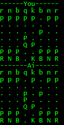

# SimpleChessAi
Very simple chess ai written in python built on top of the py-chess library. The user plays white against the ai in the command line. The program accepts standard chess notation and only allows valid moves to be played. The ai uses a min-max algorithm to determine the move that puts black in the best advantage. Exit using q.

# Future improvements
- Add valuation of positions.
- Add support for probing the endgame database.

# Screenshot.
 

